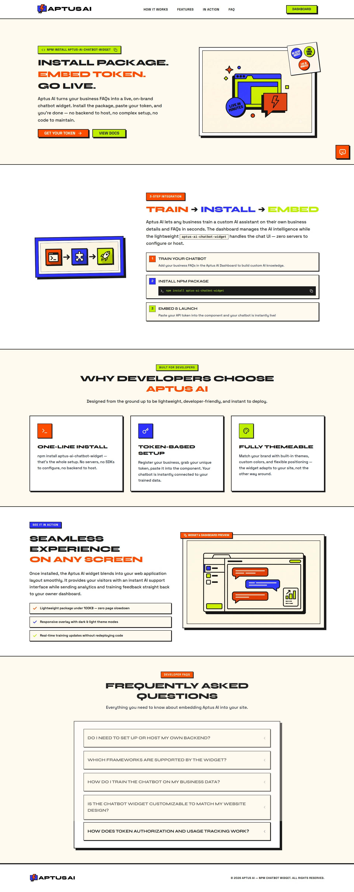
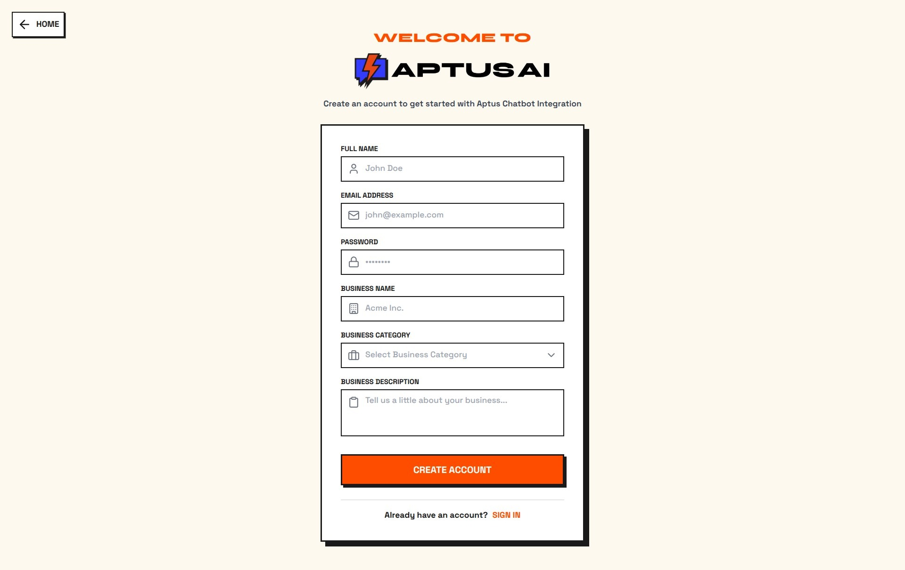
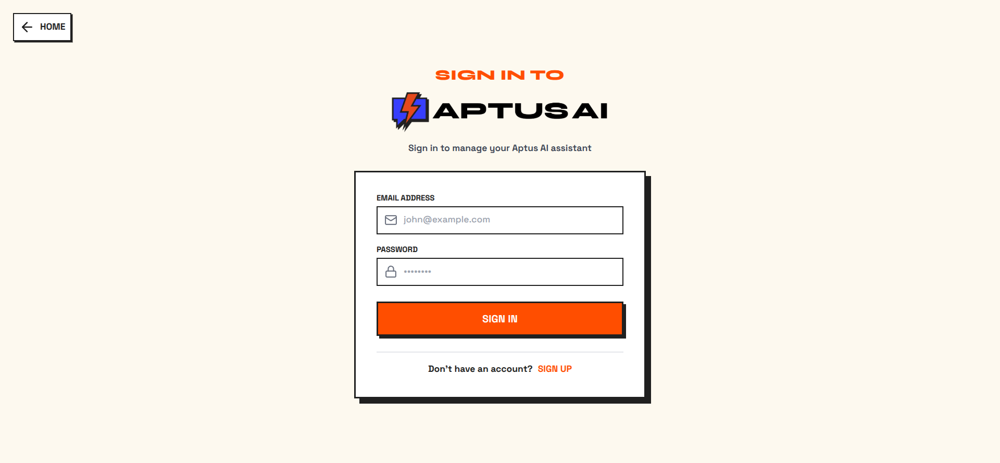
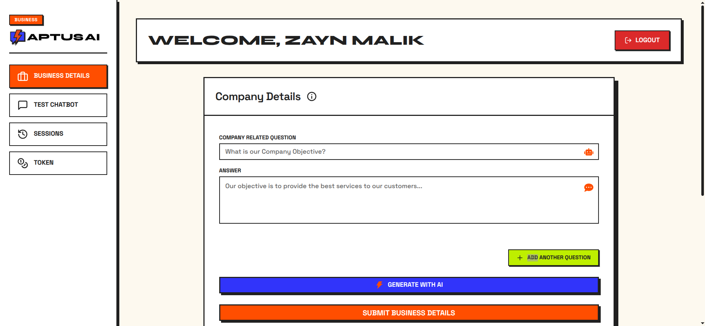
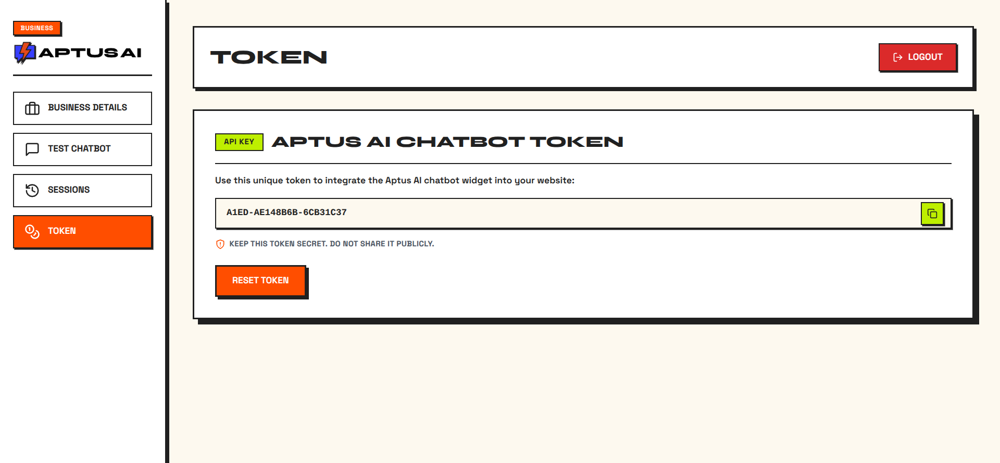
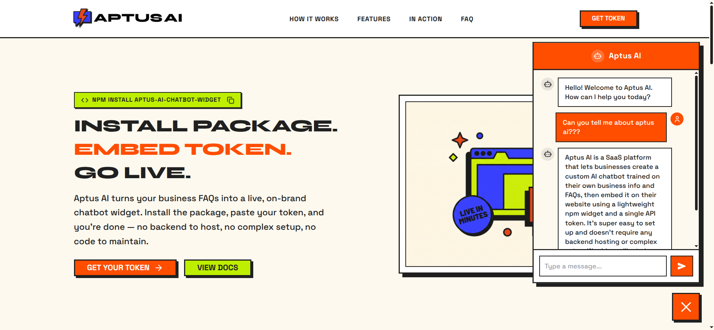
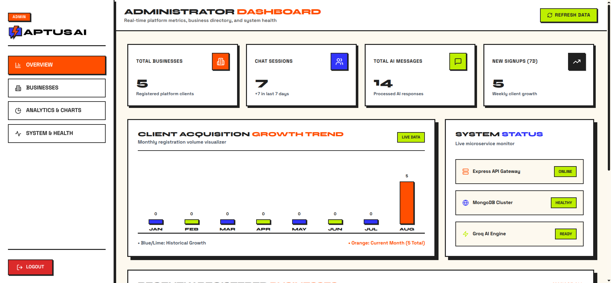
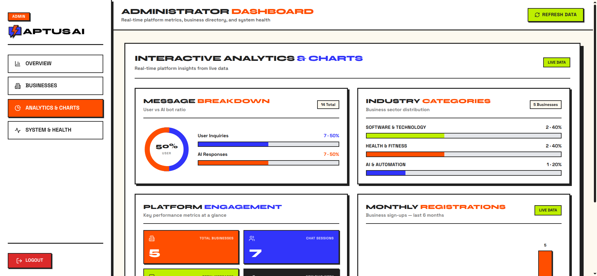

# 🚀 Aptus AI — Custom AI Chatbot Platform

[](https://nextjs.org/)
[](https://expressjs.com/)
[](https://www.mongodb.com/)
[](https://groq.com/)
[](https://www.npmjs.com/package/aptus-ai-chatbot-widget)

Aptus AI is a premium, full-stack SaaS platform that empowers businesses to build, train, and deploy custom AI-powered chatbots in minutes. Business owners register, train their chatbot on their specific Q&A knowledge base, and integrate it into any website using a single npm package.

---

## 📸 Platform Previews

### 🏠 Landing Page


---

### 🔐 Sign Up


---

### 🔑 Login


---

### 🧠 Business Dashboard — Training Tab


---

### 🔗 Token Management


---

### 🤖 Widget Live in Action


---

### 🌐 Live Integration on External Platform


---

### 📊 Admin Dashboard


---

### 📈 Analytics & Charts


---

## ✨ Features

- **Instant Chatbot Setup**: Get your AI chatbot live in minutes — just enter your business details and FAQs.
- **AI-Powered Training**: Powered by **Groq API** (`llama-3.3-70b-versatile`) for high-speed, accurate completions.
- **14 Built-in Widget Themes**: From Aptus Neo-Brutalist to Cyberpunk, Nord, Dracula, ChatGPT-style, and more.
- **Interactive Training Dashboard**: Train the chatbot with AI-generated questions or manually written custom Q&As.
- **npm Widget Package**: Drop the `aptus-ai-chatbot-widget` floating chat widget onto any React / Next.js site.
- **Real-time Testing Playground**: Test chatbot responses live inside the dashboard before deploying.
- **Secure Token System**: Unique per-business chatbot tokens for secure, isolated API access.
- **Session & Message History**: Full session tracking so business owners can review every conversation.
- **Admin Dashboard**: A private admin panel to manage all registered businesses, analytics, and tokens.
- **Domain Whitelisting**: Restrict your chatbot widget to only load on specific authorized domains.

---

## 🛠️ Tech Stack & Architecture

### Frontend (Next.js App)
- **Framework**: Next.js 14 (App Router)
- **State Management**: Redux Toolkit + React Redux
- **Styling**: Tailwind CSS + NextUI
- **Animations**: Framer Motion
- **Icons**: Lucide React + React Icons

### Backend (Node.js & Express)
- **Server**: Express.js 4
- **Database**: MongoDB + Mongoose
- **AI Core**: Groq SDK (`llama-3.3-70b-versatile`)
- **Auth**: JWT + bcryptjs + HTTP-only cookies
- **Security**: Express Rate Limit, CORS, Compression, Morgan logging

### Widget (npm Package)
- **Package**: [`aptus-ai-chatbot-widget`](https://www.npmjs.com/package/aptus-ai-chatbot-widget)
- **Bundler**: tsup (ESM + CJS dual output)
- **Styling**: styled-components (zero Tailwind dependency)
- **14 Themes**: Aptus, ChatGPT, Cyberpunk, Nord, Dracula, Energy, and more

---

## 🔌 Chatbot Widget Integration

Install the npm widget and integrate it into any React or Next.js website in seconds.

### 1. Install the Widget
```bash
npm install aptus-ai-chatbot-widget
```

### 2. Import and Use the Widget
```jsx
import React from 'react';
import { ChatBot } from 'aptus-ai-chatbot-widget';

function App() {
  return (
    <div>
      <ChatBot
        token="YOUR_BUSINESS_TOKEN"
        apiUrl="https://aptus-ai-backend.vercel.app/api/v1"
        theme="aptus"
        wantToShowSuggestions={true}
      />
    </div>
  );
}

export default App;
```

### 3. Available Props

| Prop | Type | Default | Description |
|------|------|---------|-------------|
| `token` | `string` | **(Required)** | Your unique business chatbot token. |
| `apiUrl` | `string` | **(Required)** | Your Aptus AI backend API URL. |
| `theme` | `string` | `"aptus"` | One of 14 built-in themes. |
| `borderRadius` | `string\|number` | *Theme Default* | Custom widget border radius. |
| `toggleBtnRadius` | `string\|number` | *Theme Default* | Custom launcher button border radius. |
| `toggleBtnBgColor` | `string` | *Theme Default* | Custom launcher button background color. |
| `toggleBtnColor` | `string` | *Theme Default* | Custom launcher button icon color. |
| `fontFamily` | `string` | *Theme Default* | Custom font-family for the widget. |
| `position` | `'left'\|'right'` | `'right'` | Widget position on screen. |
| `animate` | `boolean` | `true` | Enables bounce animation on launcher. |
| `icon` | `ReactNode` | Chatbot icon | Custom icon for the launcher button. |
| `wantToShowSuggestions` | `boolean` | `false` | Shows AI suggestion chips. |

---

## ⚙️ Installation & Local Development

### Prerequisites
- Node.js v18+
- MongoDB Atlas or local MongoDB instance
- Groq API Key (free at [console.groq.com](https://console.groq.com/))

### Backend Setup
```bash
cd backend
npm install
```

Create `backend/config/.env`:
```env
PORT=3100
DB_URI=your_mongodb_connection_string
JWT_SECRET=your_jwt_secret
JWT_EXPIRE=10d
COOKIE_EXPIRE=10
GROQ_API_KEY=your_groq_api_key
ADMIN_EMAIL=admin@example.com
ADMIN_PASSWORD=your_admin_password
ADMIN_JWT_SECRET=your_admin_jwt_secret
```

Start the backend:
```bash
npm run server
```

### Frontend Setup
```bash
cd frontend
npm install
```

Create `frontend/.env.local`:
```env
NEXT_PUBLIC_API_URL=http://localhost:3100/api/v1
```

Start the frontend:
```bash
npm run dev
```

### Run Both Together (from `backend/`)
```bash
npm run dev
```

---

## 📄 License

Distributed under the **MIT License**.
